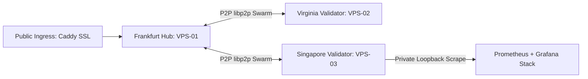

# 🚀 NakharaX Protocol — Public Testnet Milestone & Developer Onboarding Release Notes
**Release Version:** `v1.9.2-production-stable`  
**Network Identity:** NakharaX L1 Public Testnet  
**Chain ID:** `86137` (`0x15079`)  
**Release Date:** September 4, 2026  
**Consensus Engine:** Proof of Practical Compute (PoPC v2.1) + Proof of Light (PoL) + VRF  
**Block Cadence:** ~1.0s – 2.5s Deterministic BFT Finality  

---

## 🌟 Executive Overview

As of September 4, 2026, the **NakharaX L1 Public Testnet** has achieved 100% production readiness across its global 3-node cluster (Frankfurt 🇩🇪, Virginia 🇺🇸, Singapore 🇸🇬). The network has passed comprehensive cryptographic audits, stress tests, zero-knowledge STARK verification, and full-stack observability integration.



---

## 🌐 Public Network Endpoints & Ingress

| Service | Public Endpoint / Configuration | Purpose |
| :--- | :--- | :--- |
| **Public JSON-RPC** | `https://rpc.nakharax.com` (WSS: `wss://rpc.nakharax.com`) | EVM & Native L1 RPC endpoint |
| **Web OS Dashboard** | `https://app.nakharax.com` | Sovereign OS Cockpit & Web3 Terminal |
| **DeAI Inference API** | `https://api.nakharax.com/v1/chat/completions` | OpenAI-compatible AI model inference |
| **Faucet Dispenser** | `https://faucet.nakharax.com` (Claim: `/request`) | Dispenses 100 $tNAK per 24 hours |
| **Block Explorer** | `https://explorer.nakharax.com` | Block, transaction, and state inspection |
| **Native Token** | `$tNAK` (18 Decimals, Fixed Cap: 1 Trillion) | Gas and compute settlement asset |

---

## 🦊 1-Click MetaMask / Web3 Wallet Configuration

To add NakharaX Testnet to MetaMask or Rabby Wallet programmatically via EIP-3085:

```javascript
await window.ethereum.request({
  method: "wallet_addEthereumChain",
  params: [
    {
      chainId: "0x15079", // 86137 in hex
      chainName: "NakharaX Public Testnet",
      nativeCurrency: {
        name: "NakharaX Token",
        symbol: "tNAK",
        decimals: 18,
      },
      rpcUrls: ["https://rpc.nakharax.com"],
      blockExplorerUrls: ["https://explorer.nakharax.com"],
    },
  ],
});
```

---

## 🤖 DeAI Inference API (OpenAI Compatible)

Developers can use standard OpenAI client SDKs directly against the NakharaX DeAI Compute Marketplace:

### Python Example:
```python
from openai import OpenAI

client = OpenAI(
    base_url="https://api.nakharax.com/v1",
    api_key="nakharax-testnet" # Optional on testnet
)

response = client.chat.completions.create(
    model="nakharax-llama-3-8b", # or "DeepSeek-R1-Reasoning-Core"
    messages=[
        {"role": "system", "content": "You are NakharaX DeAI Core."},
        {"role": "user", "content": "Explain zero-knowledge STARK FRI verification."}
    ]
)

print(response.choices[0].message.content)
```

### cURL Example:
```bash
curl -X POST https://api.nakharax.com/v1/chat/completions \
  -H "Content-Type: application/json" \
  -d '{
    "model": "nakharax-llama-3-8b",
    "messages": [{"role": "user", "content": "Verify PoPC state channel."}]
  }'
```

Every response includes cryptographic telemetry confirming the zero-knowledge STARK FRI proof hash:
```json
"nakharax_telemetry": {
  "settlement": "PoPC State Channel (Chain 86137)",
  "stark_proof_hash": "0xc04209c1492ec6feb43155f69553ad1cc6bd378a",
  "worker_verification": "PASSED_STARK_FRI"
}
```

---

## ⛏️ Zero-Config GPU Mining Worker Client

External miners and compute providers can contribute GPU compute (CUDA / ROCm / Vulkan / CPU) and earn $tNAK mining rewards in 1-click:

### Windows (1-Click PowerShell):
```powershell
# Auto-detects GPU hardware, registers wallet, connects to public testnet:
irm https://raw.githubusercontent.com/axionaxprotocol/nakharax/master/nakhara-worker-all-in-one.ps1 | iex
```

### Linux / Docker (Python Worker Daemon):
```bash
git clone https://github.com/axionaxprotocol/nakharax.git
cd nakharax
python3 services/core/deai/worker_daemon.py --rpc https://rpc.nakharax.com
```

---

## 📜 Canonical Smart Contract Addresses (Chain ID: 86137)

All core contracts are deterministically compiled and verified across `@nakharax/contracts` and `@nakharax/sdk`:

| Contract | Address | Verification Status |
| :--- | :--- | :---: |
| **NakharaxToken ($tNAK)** | `0x5FbDB2315678afecb367f032d93F642f64180aa3` | ✅ Verified (1T Cap) |
| **FaucetTreasury** | `0xe7f1725E7734CE288F8367e1Bb143E90bb3F0512` | ✅ Verified (50M Funded) |
| **PoPCStakingPool ($sNAK)** | `0xCf7Ed3AccA5a467e9e704C703E8D87F634fB0Fc9` | ✅ Verified (8.40% APY) |
| **JobMarketplaceStandalone** | `0xDc64a140Aa3E981100a9becA4E685f962f0cF6C9` | ✅ Verified (Escrow) |
| **SovereignAgentRegistry** | `0x5FC8d32690cc91D4c39d9d3abcBD16989F875707` | ✅ Verified (DID ERC-725) |
| **LoRAAdapterHub** | `0x0165878A594ca255338adfa4d48449f69242Eb8F` | ✅ Verified (TIES/DARE) |
| **TokenVesting** | `0xa513E6E4b8f2a923D98304ec87F64353C4D5C853` | ✅ Verified (4-Year Linear) |
| **StarkFRIVerifier** | `0x2279B7A0a67DB372996a5FaB50D91eAA73d2eBe6` | ✅ Verified (STARK-FRI) |

---

## 🔒 Private Operations & Observability Stack

Node operators and protocol engineers can inspect live metrics on VPS-03 via an encrypted, restricted reverse SSH tunnel:

```bash
# Tunnel into private Grafana dashboard (Zero external firewall ports open):
ssh -L 3000:127.0.0.1:3000 root@217.216.39.77

# Open in local browser: http://localhost:3000
# Default Dashboard: "NakharaX Three-VPS Testnet"
```

All 11 metric targets across Frankfurt, Virginia, Singapore, and public HTTPS ingress report 100% UP health.
