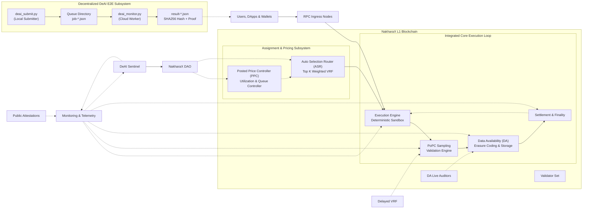
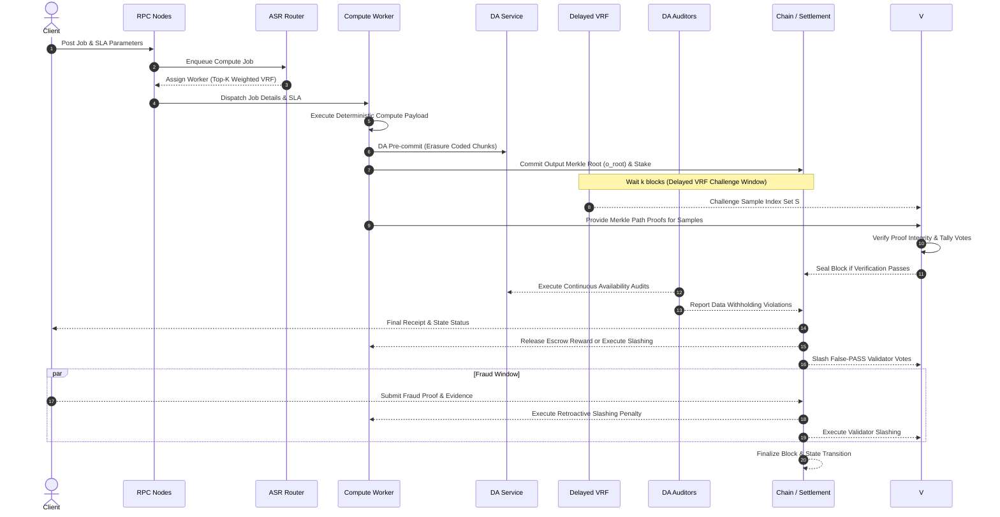
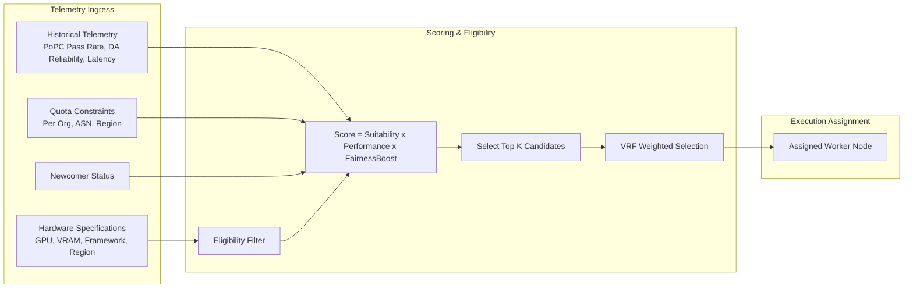
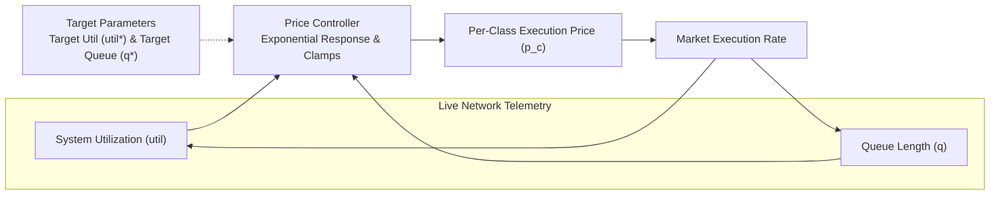
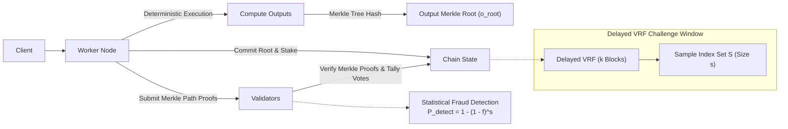
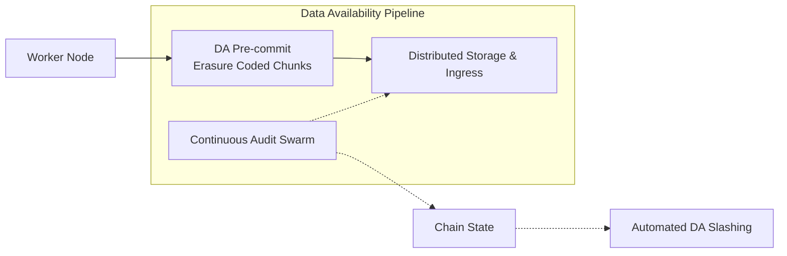
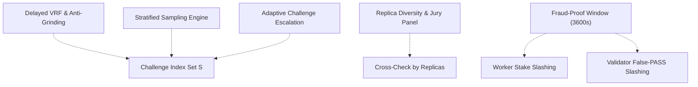

# NakharaX Protocol — Architecture Specification v2.0.0 (August 2026)

This specification details the architectural components of the **NakharaX Protocol** (v2.0.0-testnet).

**Last Updated:** May 3, 2026 | **Protocol Version:** v2.0.0-testnet

---

## 0) High-Level Architecture Overview

---

## 1) Core Execution Workflow

---

## 2) Auto-Selection Router (ASR)

---

## 3) Posted Price Controller (PPC)

---

## 4) Proof of Practical Compute (PoPC) Consensus

---

## 5) Data Availability (DA) Layer

---

## 6) Security & Anti-Fraud Architecture

---

## 7) Recommended Protocol Parameters (v2.0.0 - August 2026)

| Parameter | Recommended Value | Specification & Description |
|---|---|---|
| **$s$ (PoPC Sample Size)** | `600` – `1500` | Sample size executed during PoPC verification challenges |
| **$\beta$ (Redundancy Ratio)** | `2%` – `3%` | Proportion of jobs dispatched for cross-replica verification |
| **$K$ (Top-K Pool)** | `64` | Candidate pool size selected by ASR prior to VRF draw |
| **$q_{\max}$ (Org Quota)** | `10%` – `15%` / epoch | Maximum allowable assignment quota per ASN / Organization |
| **$\epsilon$ (Exploration Ratio)** | `5%` | Epsilon-greedy allocation ratio reserved for newcomer nodes |
| **$util^*$ (Target Utilization)** | `0.70` (70%) | Target network compute utilization metric |
| **$q^*$ (Target Queue Time)** | `60s` | Target queue latency for incoming compute jobs |
| **$k$ (Delay Blocks)** | $\ge 2$ blocks | Delay interval applied to VRF seed generation |
| **$\Delta t_{\text{fraud}}$ (Fraud Window)** | `3600s` | Active Fraud-Proof challenge window duration |
| **False-PASS Slashing Penalty** | $\ge 500$ bps | Slashing penalty levied against validators approving invalid proofs |

---

*Certified & Maintained by Lead Protocol Architect: May 2026*
