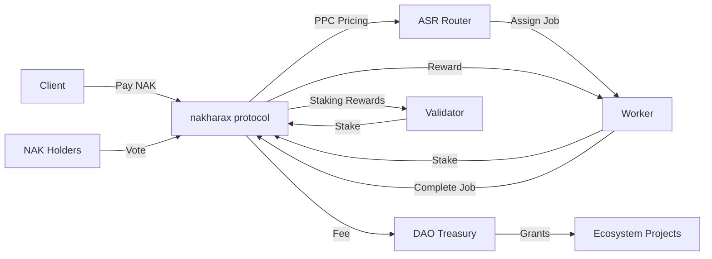

# nakharax Tokenomics

> ⚠️ **IMPORTANT NOTICE**
>
> This document describes the **MAINNET tokenomics** planned for production launch.
>
> **Current Testnet Configuration:**
>
> - Testnet uses simplified token model for testing
> - Total Supply: 1 Billion $tNAK (for testing)
> - No vesting implementation (immediate distribution)
> - See [TOKENOMICS_TESTNET.md](./TOKENOMICS_TESTNET.md) for current testnet configuration

## Overview

The NAK token is the native utility token of the nakharax protocol, designed to align incentives across all network participants while maintaining long-term sustainability and decentralization.

## Mainnet Token Supply (Production Plan)

- **Token Symbol**: NAK (Mainnet Token)
- **Token Name**: Nakharax Token
- **Total Supply**: 1,000,000,000,000 NAK (1 Trillion)
- **Supply Model**: Fixed cap (no inflation beyond initial distribution)
- **Precision**: 18 decimals
- **Network**: Mainnet (Future Launch)

## Token Utilities

### 1. Gas Fees (Transaction Costs)

- All on-chain transactions require NAK for gas
- Dynamic fee market based on network congestion
- Fee burn mechanism (optional, governance-controlled)

### 2. Staking

- **Validators**: Stake NAK to participate in consensus
  - Minimum stake: 100,000 NAK (governance parameter)
  - Slashing for misbehavior
- **Workers**: Stake NAK as collateral for compute jobs
  - Stake amount proportional to job value
  - Slashing for fraud or DA unavailability

### 3. Medium of Exchange

- Workers receive NAK for completed compute jobs
- Clients pay NAK for compute resources
- Settlement via Posted Price Controller (PPC)

### 4. Governance

- NAK holders participate in DAO governance
- Voting power proportional to staked NAK
- Vote on protocol parameters, upgrades, treasury allocation

## Token Allocation (Suggested Distribution)

| Allocation              | Percentage | Amount (NAK)    | Vesting       | Purpose                               |
| ----------------------- | ---------- | --------------- | ------------- | ------------------------------------- |
| **Ecosystem Reserve**   | 45%        | 450,000,000,000 | N/A           | Staking rewards, grants, partnerships |
| **Team & Advisors**     | 20%        | 200,000,000,000 | 4-year linear | Core contributors                     |
| **Early Investors**     | 10%        | 100,000,000,000 | 2-year linear | Seed/Private rounds                   |
| **Public Sale**         | 10%        | 100,000,000,000 | Immediate     | Community distribution                |
| **Foundation**          | 8%         | 80,000,000,000  | 3-year linear | Protocol development                  |
| **Community Airdrops**  | 5%         | 50,000,000,000  | Various       | Early adopters, testnet participants  |
| **Liquidity Provision** | 2%         | 20,000,000,000  | Immediate     | DEX liquidity                         |

### Vesting Details

**Team & Advisors (4-year linear)**

- 1-year cliff
- Monthly unlocks after cliff
- Subject to performance milestones

**Early Investors (2-year linear)**

- 6-month cliff
- Monthly unlocks after cliff

**Foundation (3-year linear)**

- No cliff
- Quarterly unlocks
- Transparency reports required

## Emission Schedule & Mainnet Parameters (Ratified Option A)

### Core Blockchain Cadence & Supply
- **Total Supply**: 1,000,000,000,000 NAK (1 Trillion Fixed Cap)
- **Block Cadence**: 1.0 second (1,000ms Pipelined Finality)
- **Annual Block Count**: 31,536,000 blocks / year
- **Ecosystem & Staking Reserve**: 45% (450,000,000,000 NAK)

### Mainnet Block Reward & Emission Model (Option A)
- **Genesis Block Reward**: **1,000 NAK / block**
- **Daily Emission**: 86,400,000 NAK / day
- **Annual Initial Emission**: 31,536,000,000 NAK / year (~3.15% of Total Supply)
- **Emission Duration**: ~14.2 years without halving (25+ years with 4-year halving schedule)

### Halving Schedule (4-Year Epoch Cycles)
- **Epoch 1 (Year 1–4)**: 1,000 NAK / block (~31.536B NAK / year)
- **Epoch 2 (Year 5–8)**: 500 NAK / block (~15.768B NAK / year)
- **Epoch 3 (Year 9–12)**: 250 NAK / block (~7.884B NAK / year)
- **Epoch 4+ (Year 13+)**: Pure Fee Economy (90%+ revenue from DeAI 5% compute fee + Gas fees)

### Staking & Compute Rewards Distribution Formula
```
Total Rewards per Epoch = Ecosystem Reserve × Emission Rate / Epochs per Year

Validator Reward_i = (Stake_i / Total_Stake) × Total Rewards × Performance_i
Worker Reward_i = Job_Value × (1 - Protocol_Fee 5%) × Quality_Score_i
```

### Fee Split Invariant (Protocol 3-Tier Allocation)
- **50% EIP-1559 BaseFee Burn**: Permanently burned from circulation.
- **30% DAO Ecosystem Treasury**: Direct ingress to `0x23618e81E3f5cdF7f54C3d65f7FBc0aBf5B21E8f`.
- **20% Validator Priority Yield**: Rewarded to block validator for transaction ordering.

## Economic Parameters (Governance-Controlled)

| Parameter                   | Initial Value | Description                   |
| --------------------------- | ------------- | ----------------------------- |
| **Block Time**              | 1.0 second    | Pipelined consensus cadence   |
| **Genesis Block Reward**    | 1,000 NAK     | Coinbase reward per block     |
| **Validator Min Stake**     | 100,000 NAK   | Minimum to become validator   |
| **Worker Stake Ratio**      | 10-20%        | Stake as % of job value       |
| **Protocol Fee**            | 5%            | Fee on compute jobs (Treasury)|
| **Slash Rate (Fraud)**      | 100%          | Penalty for proven fraud      |
| **Slash Rate (DA Fail)**    | 50%           | Penalty for DA unavailability |
| **Slash Rate (False PASS)** | 500 bp (5%)   | Validator voting wrong        |
| **Annual Emission Rate**    | ~3.15%        | Annual staking yield target   |

## Token Flow Diagram



## Fee Structure

### Transaction Fees

- **Base Fee**: Dynamic, adjusted based on network congestion
- **Priority Fee**: Optional tip for faster inclusion
- **Fee Destination**: 50% burn / 50% treasury (governance-controlled)

### Compute Job Fees

```
Total Job Cost = Base Price (PPC) × Job Size + Protocol Fee

Worker Payout = Total Job Cost × (1 - Protocol Fee %) × Quality Multiplier
Protocol Fee → DAO Treasury
```

### Slashing Distribution

```
Slashed Amount = Stake × Slash Rate

Distribution:
- 50% → Fraud reporter / DA auditor (if applicable)
- 30% → DAO Treasury
- 20% → Validator reward pool
```

## Treasury Management

### DAO Treasury Sources

1. Protocol fees from compute jobs (5%)
2. Transaction fees (50% of collected fees)
3. Slashing penalties (30% of slashed amounts)

### Treasury Allocation (Governance-Voted)

- **Grants & Partnerships**: 40%
- **Development Bounties**: 30%
- **Marketing & Community**: 20%
- **Reserve/Emergency Fund**: 10%

## Long-Term Sustainability

### Deflationary Mechanisms (Optional)

- Fee burning (governance-activated)
- Unclaimed reward burning after 1 year

### Growth Incentives

- Early worker bonus (year 1-2): +20% rewards
- Geographic diversity bonus: +10% for underserved regions
- Newcomer boost (ASR ε-greedy): 5% allocation

## Token Metrics (Projected)

### Year 1 (Testnet → Mainnet)

- **Circulating Supply**: ~150B NAK (15%)
- **Staked %**: Target 40-50%
- **Validator Count**: 100+
- **Worker Nodes**: 500+

### Year 3 (Mature Network)

- **Circulating Supply**: ~400B NAK (40%)
- **Staked %**: Target 50-60%
- **Validator Count**: 500+
- **Worker Nodes**: 5,000+

### Year 5 (Fully Distributed)

- **Circulating Supply**: ~800B NAK (80%)
- **Staked %**: Target 50-60%
- **Validator Count**: 1,000+
- **Worker Nodes**: 20,000+

## Governance Parameters Subject to DAO Vote

All economic parameters can be adjusted via governance proposals:

- Staking minimums
- Emission rates
- Protocol fees
- Slashing rates
- Fee burn percentage
- Treasury allocation

## Audits & Compliance

- **Token Contract Audit**: [Pending - Q1'26]
- **Economic Model Review**: [Pending - Q2'26]
- **Legal Opinion**: [Pending - Q2'26]

## References

- Whitepaper v1.5, Section "Tokenomics"
- [Governance Documentation](./GOVERNANCE.md)
- [Security Model](./SECURITY.md)

---

**Note**: Token allocation and economics are subject to change based on DAO governance and regulatory review.

Last Updated: 2025-12-05 | v1.8.0-testnet
