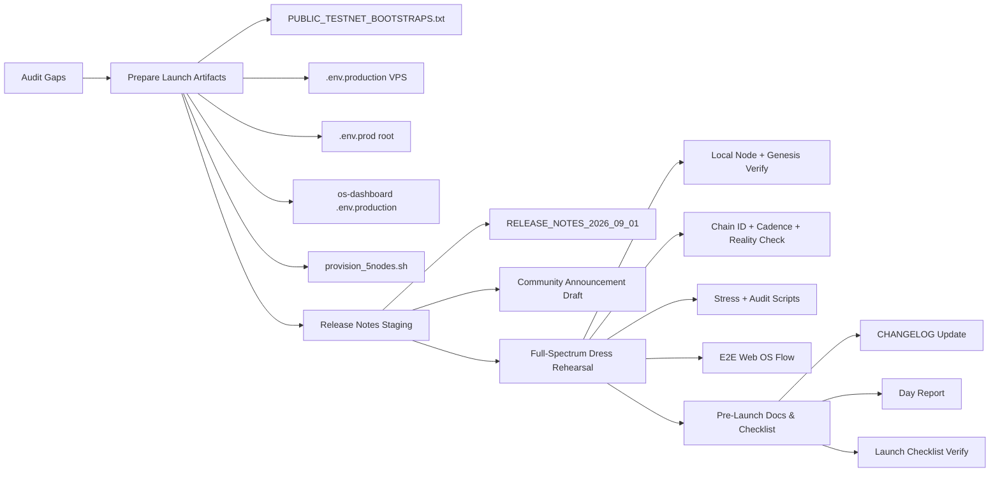

# 🚀 D-1 Launch Preparation Plan — 31 August 2026

**Target Event:** NakharaX Genesis Public Testnet Launch (1 September 2026, Chain ID `86137`)
**Today (D-1):** Full-spectrum dress rehearsal + community release notes staging + launch artifacts preparation
**Reference Runbook:** [`docs/ops/1_SEP_GENESIS_RUNBOOK.md`](../docs/ops/1_SEP_GENESIS_RUNBOOK.md)

---

## 📌 Current Gaps Identified (Audit Result)

| # | Gap | Severity | Location |
| :--- | :--- | :---: | :--- |
| 1 | `PUBLIC_TESTNET_BOOTSTRAPS.txt` (งาน D-3) ไม่มีใน repo | 🔴 High | root |
| 2 | `.env.production` สำหรับ VPS deploy ยังไม่มี (มีแค่ `.env.example`) | 🔴 High | `services/core/ops/deploy/` |
| 3 | Root `.env.prod` ที่ `docker-compose.prod.yml` ต้องการ (`POSTGRES_PASSWORD`) ยังไม่มี | 🔴 High | root |
| 4 | `apps/os-dashboard/.env.production` ยังไม่ได้สร้างจาก example | 🟡 Medium | `apps/os-dashboard/` |
| 5 | สคริปต์ `provision_5nodes.sh` ที่อ้างอิงในแผน VPS ยังไม่มี (มีแค่ `deploy-node.sh`) | 🟡 Medium | `services/core/ops/deploy/` |
| 6 | Community release notes ยังไม่มีการ staging | 🟡 Medium | `docs/` |
| 7 | Checklist ใน `GENESIS_LAUNCH_DAY_CHECKLIST.md` หลายข้อยังไม่ tick | 🟡 Medium | `docs/core/` |

---

## 🧭 D-1 Workflow

---

## ✅ Phase A — Prepare Launch Artifacts (Bootstrap + Env)

### A1. Create `PUBLIC_TESTNET_BOOTSTRAPS.txt`
- ไฟล์ template เก็บ multiaddr ทั้ง 5 โหนด ตาม format `/ip4/<IP>/tcp/30303/p2p/<PEER_ID>`
- ใช้ `Node 01 (Master Hub)` เป็น seed หลัก + 4 satellites
- ระบุ placeholder ชัดเจน (จะเติม IP/Peer ID จริงตอน provisioning)
- เนื้อหา: 5 บรรทัด multiaddr + header อธิบาย chain id `86137`

### A2. Create `services/core/ops/deploy/.env.production`
- คัดลอกจาก `.env.example` + เพิ่ม field ที่ `docker-compose.vps.yml` ต้องการ:
  - `NAKHARAX_PUBLIC_IP`
  - `NAKHARAX_BOOTSTRAP_NODES=/ip4/<NODE1_IP>/tcp/30303/p2p/<NODE1_PEER_ID>`
  - `FAUCET_PRIVATE_KEY` / `DB_PASSWORD` / `REDIS_PASSWORD` / `GRAFANA_PASSWORD`
  - `POSTGRES_DB` / `POSTGRES_USER` / `POSTGRES_PASSWORD`
  - `VPS_IP` / `DOMAIN=nakharax.com`

### A3. Create root `.env.prod`
- จำเป็นโดย `docker-compose.prod.yml` (`POSTGRES_PASSWORD:?`)
- ประกอบด้วย `POSTGRES_DB`, `POSTGRES_USER`, `POSTGRES_PASSWORD`

### A4. Create `apps/os-dashboard/.env.production`
- จาก [`apps/os-dashboard/.env.example`](../apps/os-dashboard/.env.example)
- `NEXT_PUBLIC_CHAIN_ID=86137`, `NEXT_PUBLIC_RPC_URL=https://rpc.nakharax.com`, `PORT=3030`, fallback EU/AU

### A5. Create `services/core/ops/deploy/provision_5nodes.sh`
- สคริปต์ 1-click รับ IP ทั้ง 5 (ตาม [`plans/vps_deployment_plan.md`](../plans/vps_deployment_plan.md:51))
- สร้าง `.env.production` อัตโนมัติ + กระจาย multiaddr P2P ให้ 4 satellites ชี้หา Node 01
- เรียกใช้ `deploy-node.sh` ต่อเนื่อง

### A6. Security: add `.env.production*` / `.env.prod` to `.gitignore`
- ป้องกัน private key รั่วไหล

---

## ✅ Phase B — Community Release Notes Staging

### B1. Create `docs/RELEASE_NOTES_2026_09_01.md`
- เนื้อหาสำหรับผู้ใช้: Chain ID `86137`, RPC endpoints, Faucet 100 $tNAK, วิธีเชื่อม MetaMask 1-click, วิธีเข้าร่วมเป็น worker, สรุป tokenomics testnet

### B2. Create Community Announcement Draft
- ข้อความสั้นสำหรับ Discord/Telegram/X — ประกาศ Genesis Launch เวลา 07:00 BKK
- ลิงก์ไป release notes + runbook

### B3. Verify links ใน release notes ชี้ไฟล์จริงใน `docs/web/web-integration/`

---

## ✅ Phase C — Full-Spectrum Dress Rehearsal (Local)

### C1. Local Node & Genesis Verification
- รัน `scripts/simulate_live_testnet.mjs` หรือ `scripts/launch_genesis.sh` (dry-run)
- ตรวจ `sha256sum services/core/core/tools/genesis.json` ตรงกับ blueprint SHA-256 `0xed1bdac7...`

### C2. Chain Invariants
- ตรวจ RPC `eth_chainId` = `0x15079` (86137)
- ตรวจ block cadence 3.0s ผ่าน `scripts/audit_live_blocks.py`
- รัน `scripts/reality_check.py` ให้ได้ 100% Reality Score

### C3. Stress & Audit Scripts
- รัน stress test (1,000 blocks / 100 jobs) ยืนยัน > 100 jobs/s, error 0%
- รัน `scripts/audit_p2p_mesh.py`, `audit_protocol_parameters.py`, `audit_token_economy.py`, `audit_wallets.py`

### C4. Smart Contract Deployment Dry-Run
- ตรวจ `packages/contracts/hardhat.config.js` มี network `nakharaxTestnet` ชี้ RPC `http://127.0.0.1:8545`
- รัน `npx hardhat run scripts/deploy.js --network nakharaxTestnet` (local)

### C5. E2E Web OS Flow
- เปิด `http://localhost:3030` → faucet claim 100 tNAK → staking 8.4% APY → `/jobs` marketplace → MetaMask chain switch

---

## ✅ Phase D — Pre-Launch Docs & Checklist

### D1. Update `docs/CHANGELOG.md`
- เพิ่ม entry 2026-08-31 (D-1): สร้าง launch artifacts, release notes, dress rehearsal ผลลัพธ์

### D2. Create Day Report `docs/DAY_REPORT_2026_08_31.md`
- บันทึกผล D-1 พร้อม metrics และสถานะพร้อม 100%

### D3. Verify/Update `docs/core/GENESIS_LAUNCH_DAY_CHECKLIST.md`
- Tick ข้อที่เสร็จ + ระบุขั้นตอนที่เหลือสำหรับ D-Day

---

## 📋 Execution Order

1. A1 → A6 (artifacts) — เร็วที่สุด, ไม่บล็อกงานอื่น
2. B1 → B3 (release notes)
3. C1 → C5 (dress rehearsal) — ใช้ artifacts/ความรู้จาก A
4. D1 → D3 (docs & checklist)
