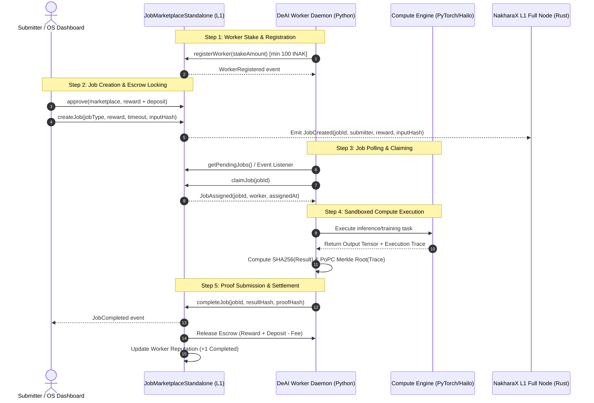

# 📑 Technical Specification: Live On-Chain Job Marketplace Deployment & Verification

**Status:** Proposed Architecture & Deployment Plan  
**Target Network:** NakharaX L1 Testnet (Chain ID: `86137`)  
**Target Release Date:** 2026-09-01 (Public Testnet Genesis)  
**Author:** Antigravity Principal AI Architect & Protocol Lead  

---

## 1. Executive Summary & Objective

The primary objective is transitioning the NakharaX DeAI Compute Marketplace from offline dry-run simulation mode (`MOCK`) into fully authenticated, **Live On-Chain Settlement (`LIVE`)**.

In this architecture:
1. **Job Submitter (Client / OS Dashboard):** Deposits `$tNAK` reward + buffer escrow into [`JobMarketplaceStandalone.sol`](packages/contracts/contracts/JobMarketplaceStandalone.sol:15) with an IPFS / data hash of model input tensors.
2. **Worker Node (Silicon PyTorch Engine):** Listens for `JobCreated` events, registers stake, claims the job via `claimJob(jobId)`, and executes model inference in a local PyTorch sandbox.
3. **Verification & Settlement:** The Worker generates a cryptographic PoPC (Proof of Probabilistic Checking) Merkle root and result hash, calling `completeJob(jobId, resultHash, proofHash)`.
4. **Reward Payout:** After the dispute window elapses or instant verification passes, escrowed `$tNAK` is transferred to the worker, updating on-chain reputation scores.

---

## 2. End-to-End System Architecture



---

## 3. Component Specification & Interfaces

### 3.1 Smart Contract Layer: [`JobMarketplaceStandalone.sol`](packages/contracts/contracts/JobMarketplaceStandalone.sol:15)
- **Token Asset:** [`NakharaxToken.sol`](packages/contracts/contracts/NakharaxToken.sol:7) (`$tNAK` - 1 Trillion fixed supply)
- **Escrow Mechanics:**
  - Submitter locks `reward` + `reward / 10` (10% collateral buffer).
  - Platform fee: 100 bps (1.0%).
  - Minimum worker stake: 100 `$tNAK`.
  - Dispute timeout window: Default 300 seconds (configurable).
- **Core Functions:**
  - `registerWorker(uint256 stakeAmount)`
  - `createJob(uint8 jobType, uint256 reward, uint256 timeout, bytes32 inputHash)`
  - `claimJob(uint256 jobId)`
  - `completeJob(uint256 jobId, bytes32 resultHash, bytes32 proofHash)`
  - `claimReward(uint256 jobId)` / `disputeJob(uint256 jobId)`

### 3.2 Python DeAI Worker Layer: [`services/core/core/deai/contract_manager.py`](services/core/core/deai/contract_manager.py:56)
- **Configuration Switches:**
  - `NAKHARAX_MARKETPLACE_ADDRESS`: Deployed checksum address (replaces `0x000...000`).
  - `NAKHARAX_CHAIN_ID`: `86137`.
  - `NAKHARAX_RPC_URL`: `http://127.0.0.1:8545` (or testnet RPC).
- **Worker Key Management:**
  - Local keystore decrypted via [`wallet_manager.py`](services/core/core/deai/wallet_manager.py:20) using `AES-256-GCM` or direct HD wallet path `m/44'/60'/0'/0/0`.
- **EIP-1559 Transaction Signing:**
  - Automated nonce fetching and gas estimation with fallback to 1.5 Gwei priority fee.

### 3.3 Web OS Dashboard & SDK Layer: [`apps/os-dashboard`](apps/os-dashboard/src/app/jobs/page.tsx:1) & [`packages/sdk`](packages/sdk/src/contracts.ts:6)
- Connects directly to deployed addresses in [`packages/sdk/src/contracts.ts`](packages/sdk/src/contracts.ts:6).
- Renders live pending job queues, active worker telemetry, and instant DeepSeek / LLaMA-3.3 job dispatches.

---

## 4. Step-by-Step Deployment & Live Verification Plan

### Phase 1: Local L1 & Contract Deployment
1. **Start L1 Blockchain Node:**
   ```bash
   cd services/core/ops/deploy
   docker-compose up -d nakharax-node
   ```
2. **Deploy Smart Contracts Suite:**
   ```bash
   pnpm --filter @nakharax/contracts hardhat run scripts/deploy.js --network localhost
   ```
3. **Export Address Manifest:**
   - Write deployed addresses to [`packages/contracts/deployed-contracts.json`](packages/contracts/deployed-contracts.json).
   - Sync addresses into [`packages/sdk/src/contracts.ts`](packages/sdk/src/contracts.ts:6) and [`services/core/core/deai/worker_config.toml`](services/core/core/deai/worker_config.toml).

### Phase 2: Worker Staking & Live Daemon Initialization
1. **Fund Worker Account via Faucet:**
   - Transfer 1,000 `$tNAK` from Faucet Treasury to Worker address.
2. **Execute Worker Registration:**
   - Worker calls `approve` and `registerWorker(100 tNAK)`.
3. **Launch Worker Daemon in LIVE Mode:**
   ```bash
   export NAKHARAX_MARKETPLACE_ADDRESS=<DEPLOYED_ADDRESS>
   export NAKHARAX_CHAIN_ID=86137
   python services/core/core/deai/worker_node.py --live
   ```

### Phase 3: End-to-End Live Job Execution Test
1. **Dispatch Job via SDK / Script:**
   - Execute [`services/core/core/deai/deai_submit.py`](services/core/core/deai/deai_submit.py) to submit an MNIST / LLM inference job.
2. **Verify Transaction Receipts on L1:**
   - Check block confirmation, transaction receipt, and event logs (`JobCreated` -> `JobAssigned` -> `JobCompleted`).
3. **Verify State & Balance Updates:**
   - Submitter escrow debited.
   - Worker balance credited with net reward.
   - Worker profile `jobsCompleted` incremented to `1`.

---

## 5. Security & Operational Hardening

| Area | Threat Vector | Mitigation Strategy |
| :--- | :--- | :--- |
| **Worker Front-running** | Malicious node claims job without computing | `claimJob` locks assignment; timeout slash if not completed within `timeout` window |
| **Tampered Results** | Worker returns bogus output | Client verifies `resultHash` against sample PoPC Merkle proof; dispute mechanism slashes worker stake |
| **Reentrancy Attacks** | Drain escrow via malicious fallback | `nonReentrant` modifier on all state-changing contract functions |
| **RPC Key Exposure** | Worker private key leak | Encrypted keystore with secure memory wipe on daemon shutdown |

---

## 6. Deliverables & Sign-Off Checklist

- [ ] Updated [`packages/sdk/src/contracts.ts`](packages/sdk/src/contracts.ts:6) with live testnet addresses.
- [ ] End-to-end integration test passing in [`services/core/core/deai/test_job_execution.py`](services/core/core/deai/test_job_execution.py).
- [ ] OS Dashboard `/jobs` interface reflecting live blockchain transactions.
