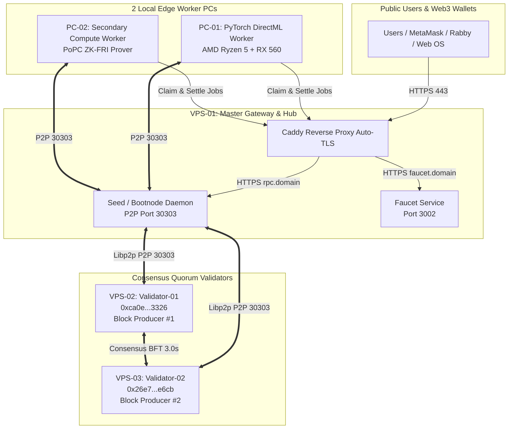

# 🚀 NakharaX Public Testnet — 3 Cloud VPS + 2 Local Workers Launch Specification

**Target Event:** Genesis Public Testnet Launch (Chain ID `86137`, Hex `0x15079`)  
**Budget Tier:** $17.00 / Month Max (Estimated Actual: **~$14.50 / Month**)  
**Architecture:** 3 Dedicated Cloud VPS + 2 Local Edge GPU Workers  
**Reference Runbook:** [`docs/ops/1_SEP_GENESIS_RUNBOOK.md`](../docs/ops/1_SEP_GENESIS_RUNBOOK.md)

---

## 1. การจัดสรรหน้าที่และสเปกของแต่ละโหนด (Node Roles & Sizing)

| โหนด (Node) | บทบาทและบริการที่รัน (Roles & Services) | สเปกฮาร์ดแวร์แนะนำ | ผู้ให้บริการแนะนำ | ค่าบริการ/เดือน |
| :--- | :--- | :--- | :--- | :---: |
| **VPS-01** | • Master Seed / Bootnode (P2P 30303) • Public HTTPS JSON-RPC Gateway (Caddy TLS 443) • Public Faucet Service (Port 3002) • System Monitoring & Explorer API | • 4 vCPU / 8 GB RAM • 100 GB SSD • Static Public IPv4 | **Contabo Cloud VPS 4** หรือ **Hetzner CX32** | **~$5.50** |
| **VPS-02** | • Genesis Validator #1 (`0xca0e4e60f8ce825dbb820c72a7e28e28cdae3326`) • PoPC Block Producer #1 (3.0s Cadence) • Fast NVMe State Storage | • 2 vCPU / 4 GB RAM • 40 GB NVMe • Anti-DDoS Filter | **OVHcloud VPS-1** หรือ **Hetzner CX22** | **~$4.50** |
| **VPS-03** | • Genesis Validator #2 (`0x26e714016c6a91b791bb440ca8db6cd7c4d1e6cb`) • PoPC Block Producer #2 (Quorum BFT Consensus) • Redundant State Mirror | • 2 vCPU / 4 GB RAM • 40 GB NVMe • Anti-DDoS Filter | **OVHcloud VPS-1** หรือ **Hetzner CX22** | **~$4.50** |
| **PC-01** | • Master Local Development & Web OS Terminal • Primary DeAI DirectML GPU Compute Worker | AMD Ryzen 5 4500 16 GB RAM / RX 560 4GB | Local Hardware | **$0.00** |
| **PC-02** | • Secondary DeAI Compute Worker (ZK Prover) • Stress Test & Network Health Probe | Multi-Core CPU / GPU | Local Hardware | **$0.00** |
| **รวมทั้งสิ้น** | **3 Cloud VPS + 2 GPU Workers Swarm** | **8 vCPU / 16 GB RAM / 180 GB Disk** | | **~$14.50 / เดือน** |

---

## 2. แผนผังการเชื่อมต่อโครงข่าย (Network Topology)

---

## 3. การตั้งค่า DNS Records (ชี้เป้าหมายตาม IP จริง)

เมื่อได้ IP ของ VPS ทั้ง 3 เครื่อง ทำการสร้าง DNS A Records ดังนี้:

| Host / Subdomain | Type | Target IP | หน้าที่ |
| :--- | :---: | :--- | :--- |
| `rpc.<DOMAIN>` | **A** | `VPS-01_IP` | Public JSON-RPC Endpoint |
| `faucet.<DOMAIN>` | **A** | `VPS-01_IP` | Public Faucet API |
| `app.<DOMAIN>` | **A** | `VPS-01_IP` (หรือ Cloudflare/Vercel) | Web OS Dashboard |
| `@` / `www.<DOMAIN>` | **A** | `VPS-01_IP` (หรือ Web Host) | Landing Page / Docs |

---

## 4. ลำดับขั้นตอนการติดตั้ง (Step-by-Step Execution Sequence)

1. **เตรียม VPS ทั้ง 3 เครื่อง:**
   - ติดตั้ง Ubuntu 22.04 หรือ 24.04 LTS
   - ตั้งค่า Firewall (UFW): เปิด Port `22` (SSH), `30303` (P2P), และเฉพาะ VPS-01 เปิด `80/443` (HTTP/HTTPS)
2. **เริ่มรัน VPS-01 (Seed Bootnode):**
   - Clone Repo และรัน [`services/core/ops/deploy/scripts/nakharax-node-bootstrap.sh`](../services/core/ops/deploy/scripts/nakharax-node-bootstrap.sh) ด้วย role `bootnode`
   - ดึง `SEED_MULTIADDR` (`/ip4/<VPS01_IP>/tcp/30303/p2p/<PEER_ID>`)
3. **เริ่มรัน VPS-02 และ VPS-03 (Validators):**
   - รัน bootstrap script ด้วย role `validator` พร้อมระบุ `NAKHARAX_BOOTSTRAP_NODES="$SEED_MULTIADDR"`
   - ตรวจสอบการซิงก์บล็อกและความต่อเนื่องของ Block Production ทุกๆ 3.0 วินาที
4. **ตั้งค่า Caddy และ Faucet บน VPS-01:**
   - ติดตั้ง Caddy Reverse Proxy ออกใบรับรอง TLS อัตโนมัติสำหรับ `rpc.<DOMAIN>` และ `faucet.<DOMAIN>`
   - รัน Faucet binary ด้วย Testnet Faucet Key
5. **เชื่อมต่อ Local GPU Workers (PC-01 & PC-02):**
   - รัน [`services/core/deai/worker_daemon.py`](../services/core/deai/worker_daemon.py) บน PC เชื่อมต่อไปยัง `https://rpc.<DOMAIN>`
