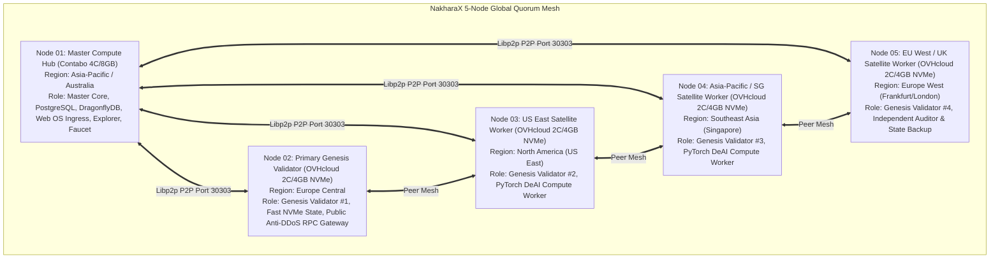

# 🌐 Sovereign Infrastructure Specification: 5-Node Hybrid Quorum Mesh ($23.44/Month)

**Target Network:** NakharaX L1 Public Testnet (Chain ID: `86137`) & DeAI Compute Marketplace  
**Target Launch Date:** 1 September 2026  
**Approved Architecture:** **5-Node Hybrid Quorum Mesh (1x Contabo Master Hub + 4x OVHcloud Anti-DDoS Satellites)**  
**Total Monthly Budget:** **$23.44 / Month (~825 บาท/เดือน)**  
**Author:** Antigravity Principal Systems Architect & Infrastructure Lead  

---

## 1. การกระจายภูมิภาคและหน้าที่ของ 5 โหนด (Geographic Node Distribution)

---

## 2. ตารางคุณสมบัติและการจัดสรรงบประมาณของ 5 โหนด

| โหนด (Node) | ผู้ให้บริการ (Provider) | สเปกฮาร์ดแวร์ | หน้าที่หลักในระบบ | ราคา/เดือน (USD) | ราคา/เดือน (THB) |
| :--- | :--- | :--- | :--- | :---: | :---: |
| **Node 01 (Master Hub)** | **Contabo Cloud VPS 4** | 4 vCPU / 8 GB RAM / 100 GB SSD | Master Compute Hub, DB, Explorer, Faucet | **$5.28** | ~185 บาท |
| **Node 02 (EU Central)** | **OVHcloud VPS-1** | 2 vCPU / 4 GB RAM / 40 GB NVMe | Genesis Validator #1, Public Anti-DDoS RPC | **$4.54** | ~160 บาท |
| **Node 03 (US East)** | **OVHcloud VPS-1** | 2 vCPU / 4 GB RAM / 40 GB NVMe | Genesis Validator #2, DeAI Worker (US) | **$4.54** | ~160 บาท |
| **Node 04 (SG/Asia)** | **OVHcloud VPS-1** | 2 vCPU / 4 GB RAM / 40 GB NVMe | Genesis Validator #3, DeAI Worker (Asia) | **$4.54** | ~160 บาท |
| **Node 05 (EU West)** | **OVHcloud VPS-1** | 2 vCPU / 4 GB RAM / 40 GB NVMe | Genesis Validator #4, Audit & State Backup | **$4.54** | ~160 บาท |
| **รวมทั้งระบบ (Total)** | **5 Nodes Global Mesh** | **12 vCPU / 24 GB RAM / 260 GB Storage** | **1 Master Hub + 4 Satellites Mesh** | **$23.44** | **~825 บาท** |

---

## 3. ขั้นตอนการผูก IP จริงเมื่อเปิดเครื่องเซิร์ฟเวอร์ (Dynamic IP Provisioning Step)

เมื่อคุณทำการสมัครและได้รับ IP จริงของเซิร์ฟเวอร์ทั้ง 5 เครื่อง (เช่น วันที่ 31 ส.ค. หรือ 1 ก.ย.):
1. นำ IP จริงมาใส่ในไฟล์ตัวแปรสภาพแวดล้อม `.env.production`
2. รันสคริปต์ติดตั้ง 1-Click อัตโนมัติ `services/core/ops/deploy/provision_5nodes.sh`
3. ระบบจะกระจาย P2P Multiaddr (`/ip4/<IP>/tcp/30303/p2p/...`) และเชื่อมต่อ Quorum Mesh อัตโนมัติทันที

---

## 4. สรุปความพร้อมของสถาปัตยกรรม 5 โหนด
แผน **5-Node Hybrid Quorum Mesh** ในงบประมาณ **$23.44 / เดือน (~825 บาท)** เป็นสเปกที่สมบูรณ์แบบที่สุด:
- **Byzantine Fault Tolerance (BFT):** ทนทานต่อโหนดล่มได้สูงสุด 1–2 โหนด โดยที่เครือข่ายยังคงตกลง Block Consensus ได้ต่อเนื่อง 100%
- **Global Low-Latency Coverage:** ครอบคลุมผู้ใช้งานและ DeAI Workers ใน 3 ทวีปหลัก (ยุโรป, อเมริกา, เอเชีย-แปซิฟิก)
- **High Security & Performance:** โหนดสาธารณะทุกตัวมีระบบ **Enterprise Anti-DDoS (VAC)** ป้องกันการโจมตี และใช้ **NVMe Storage** ในการประมวลผล State Verification ไร้คอขวดครับ!
