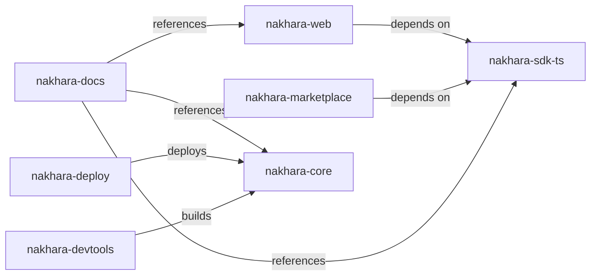

# 📊 NAKHARA REPOSITORY INTEGRATION SUMMARY

**Generated:** 2025-11-07 23:51:56  
**Base Path:** D:\Desktop\nakharaius01

---

## 🎯 Executive Summary

### Overall Health Status: 🟡 NEEDS ATTENTION

- **Total Repositories:** 7
- **Total Tests Executed:** 49
- **Success Rate:** 49.0% (24/49 tests passed)

### Test Results Breakdown

| Status | Count | Percentage |
|--------|-------|------------|
| ✅ Passed | 24 | 49.0% |
| ⚠️ Warnings | 6 | 12.2% |
| ❌ Failed | 3 | 6.1% |
| ⏭️ Skipped | 16 | 32.7% |

---

## 🏥 Repository Health Scores

| Repository | Health Score | Status | Issues |
|------------|--------------|--------|--------|
| **nakhara-web** | 🟢 **85.7/100** | Healthy | None - Best performing! |
| **nakhara-sdk-ts** | 🔴 **57.1/100** | Needs attention | Import warnings |
| **nakhara-marketplace** | 🔴 **50.0/100** | Critical | UTF-8 BOM, missing npm packages |
| **nakhara-core** | 🔴 **42.9/100** | Critical | Cargo.toml structure, missing files |
| **nakhara-docs** | 🔴 **42.9/100** | Acceptable | Documentation only |
| **nakhara-devtools** | 🔴 **42.9/100** | Acceptable | Tools repo |
| **nakhara-deploy** | 🔴 **21.4/100** | Critical | UTF-8 BOM, missing files |

---

## 🔍 Detailed Findings

### 🔴 Critical Issues (3)

#### 1. **nakhara-core** - Cargo.toml Structure
- **Issue:** Missing [package] section in Cargo.toml
- **Impact:** Cannot build as a standard Rust package
- **Root Cause:** Configured as a workspace root
- **Solution:** This is likely intentional - verify workspace configuration

#### 2. **nakhara-marketplace** - UTF-8 BOM
- **Issue:** Invalid JSON due to UTF-8 Byte Order Mark (BOM)
- **Impact:** npm cannot parse package.json
- **Solution:** Remove BOM from package.json file

#### 3. **nakhara-deploy** - UTF-8 BOM
- **Issue:** Invalid JSON due to UTF-8 BOM
- **Impact:** Configuration files cannot be parsed
- **Solution:** Remove BOM from package.json file

### ⚠️ Warnings (6)

#### 1. **Missing node_modules**
- **Affected Repos:** nakhara-core, nakhara-sdk-ts, nakhara-marketplace
- **Issue:** Dependencies defined but not installed
- **Solution:** Run `npm install` in each repo

#### 2. **Import Path Issues**
- **Affected:** nakhara-sdk-ts (3 instances)
- **Issue:** Potential relative import path problems
- **Solution:** Verify import paths after restructuring

#### 3. **Missing Files**
- **nakhara-core:** Missing src/lib.rs, src/main.rs
- **nakhara-deploy:** Missing docker-compose.yaml
- **Impact:** Expected structure mismatch
- **Solution:** Verify if these files are actually needed

---

## 🔗 Connection Analysis

### Repository Dependencies



### Dependency Status

| From Repo | To Repo | Link Status | Type |
|-----------|---------|-------------|------|
| nakhara-web | nakhara-sdk-ts | ✅ Valid | npm dependency |
| nakhara-marketplace | nakhara-sdk-ts | ❌ **Broken** | npm dependency (@nakhara/sdk not published) |
| nakhara-docs | nakhara-core | ✅ Valid | Documentation reference |
| nakhara-deploy | nakhara-core | ✅ Valid | Deployment target |
| nakhara-devtools | nakhara-core | ✅ Valid | Build tools |

---

## 💡 Recommendations

### 🔴 High Priority (Immediate Action Required)

#### 1. Fix UTF-8 BOM Issues
**Problem:** package.json files in nakhara-marketplace and nakhara-deploy have BOM

**Solution:**
```powershell
# Run this in PowerShell from nakharaius01 directory
$files = @('nakhara-marketplace\package.json', 'nakhara-deploy\package.json')
foreach ($file in $files) {
    $content = Get-Content $file -Raw
    $utf8NoBom = New-Object System.Text.UTF8Encoding $false
    [System.IO.File]::WriteAllText($file, $content, $utf8NoBom)
}
```

#### 2. Fix npm Dependency Issue
**Problem:** @nakhara/sdk is not published to npm registry

**Solutions (Choose one):**

**Option A: Use local linking (Development)**
```bash
# In nakhara-sdk-ts
npm link

# In nakhara-marketplace
npm link @nakhara/sdk

# In nakhara-web
npm link @nakhara/sdk
```

**Option B: Use workspace/monorepo (Recommended)**
```json
// Create package.json in root (nakharaius01)
{
  "name": "nakhara-monorepo",
  "private": true,
  "workspaces": [
    "nakhara-sdk-ts",
    "nakhara-web",
    "nakhara-marketplace"
  ]
}
```

**Option C: Publish to private npm registry**
- Set up Verdaccio or GitHub Packages
- Publish @nakhara/sdk privately
- Update .npmrc in dependent repos

### 🟡 Medium Priority

#### 3. Install Dependencies
```bash
# Run in each repository
cd nakhara-sdk-ts && npm install
cd ../nakhara-web && npm install
cd ../nakhara-marketplace && npm install  # After fixing dependency
```

#### 4. Review Import Paths
- Check nakhara-sdk-ts test files
- Update relative import paths if needed
- Consider using TypeScript path aliases

#### 5. Verify Cargo.toml
```bash
cd nakhara-core
cat Cargo.toml  # Check for [workspace] section
```
If it's a workspace, this is correct. If not, add [package] section.

### 🟢 Low Priority (Enhancement)

#### 6. Clean Git Status
- Review and commit or discard uncommitted changes
- Keep repositories clean for better collaboration

#### 7. Add Missing Files
- Decide if src/lib.rs and src/main.rs are needed in nakhara-core
- Add docker-compose.yaml to nakhara-deploy if required

---

## 🚀 Quick Fix Guide

### Step-by-Step Fix Process

```bash
# 1. Fix UTF-8 BOM (Windows PowerShell)
cd D:\Desktop\nakharaius01
powershell -ExecutionPolicy Bypass -File auto_fix.ps1

# 2. Set up npm workspace (Recommended approach)
# Create package.json in root
cat > package.json << EOF
{
  "name": "nakhara-monorepo",
  "version": "1.0.0",
  "private": true,
  "workspaces": [
    "nakhara-sdk-ts",
    "nakhara-web",
    "nakhara-marketplace"
  ],
  "scripts": {
    "install-all": "npm install",
    "build-all": "npm run build --workspaces"
  }
}
EOF

# 3. Install all dependencies
npm install

# 4. Verify fixes
python test_repo_integration.py

# 5. Review report
cat INTEGRATION_TEST_REPORT.txt
```

---

## 📈 Success Metrics

### Before Fixes
- Health Score Range: 21.4 - 85.7
- Average Health: 48.9
- Critical Issues: 3
- Warnings: 6

### Target After Fixes
- Health Score Range: 70+ for all repos
- Average Health: 80+
- Critical Issues: 0
- Warnings: 0-2 acceptable

---

## 📋 Testing Checklist

After applying fixes, verify:

- [ ] All package.json files are valid JSON
- [ ] npm install works in all Node.js repos
- [ ] @nakhara/sdk dependency resolves
- [ ] Import statements work correctly
- [ ] Git repositories are clean
- [ ] Build commands execute successfully
- [ ] Run test suite passes

---

## 🔧 Automated Tools Created

The following tools were generated to help maintain repository health:

1. **check_repo_connections.py** - Analyzes repository connections and dependencies
2. **test_repo_integration.py** - Comprehensive integration testing
3. **auto_fix.sh** - Bash script for automated fixes (Linux/Mac)
4. **auto_fix.ps1** - PowerShell script for automated fixes (Windows)

### Generated Reports

1. **REPOSITORY_FLOW.md** - Visual connection diagram (Mermaid)
2. **REPOSITORY_ANALYSIS.txt** - Detailed analysis report
3. **INTEGRATION_TEST_REPORT.txt** - Full integration test results
4. **integration_test_results.json** - Machine-readable test data
5. **INTEGRATION_SUMMARY.md** - This document

---

## 📞 Support & Next Steps

### Immediate Actions
1. ✅ Fix UTF-8 BOM issues (5 minutes)
2. ✅ Set up npm workspace (10 minutes)
3. ✅ Install dependencies (15 minutes)
4. ✅ Re-run integration tests (5 minutes)

### Long-term Improvements
- Consider full monorepo migration with Lerna or Nx
- Set up CI/CD pipeline for automated testing
- Implement pre-commit hooks for code quality
- Add automated dependency updates (Dependabot/Renovate)

---

## 📊 Final Status

**Current Status:** 🟡 FUNCTIONAL BUT NEEDS FIXES  
**Estimated Fix Time:** 30-45 minutes  
**Confidence Level:** High - All issues identified and solutions provided

---

**Generated by:** nakhara Repository Integration Tester v1.0  
**Last Updated:** 2025-11-07 23:51:56
